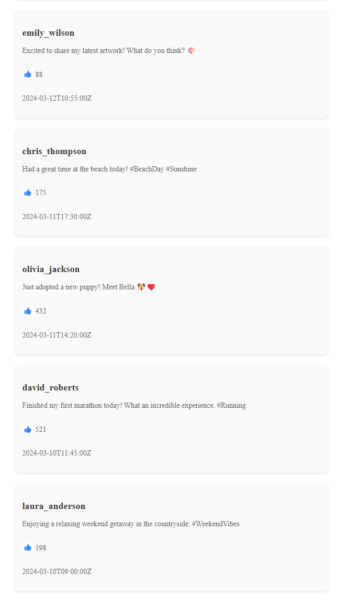

# React Assignment 1

### Social Media Feed

You are making a mockup of a social media feed 👍 I have included the data in the assets folder (posts.js). Leave it where it is, and import it where needed. You have to loop over the data. (Hint: use .map()). I've also included a like icon.

Use this component structure:

`App
⤷ Feed
⤷ Post`

This means that App will render the Feed component, and Feed will render the Post components.

The image above shows what we are aiming for.

Ask me or your fellow students if you have any questions, good luck!
